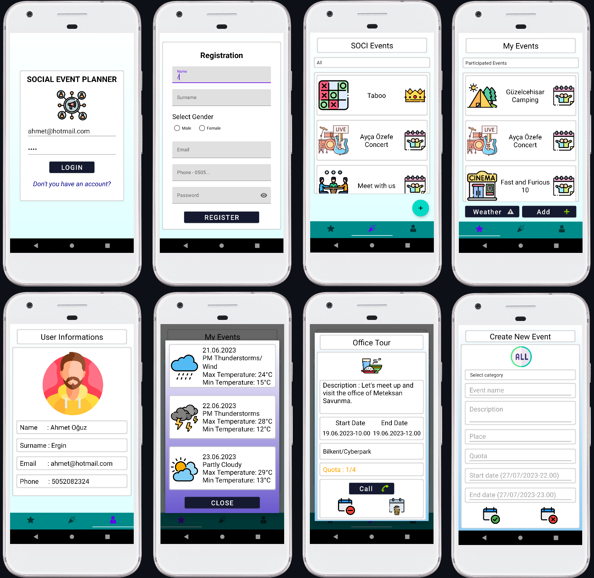

<h1 align="center">Social Event Planner - SOCI</h1>  

    

 

## Table of Contents

- [Demo](#demo)
- [Introduction](#introduction)
- [Technologies](#technologies)
- [Features](#features)
- [Contributors](#contributors)

 

## Demo

 

    

 

## Introduction

This project was developed for Android using the Java language. The purpose of this project is to enable people to share and participate in activities among each other.

 

## Technologies

* Java

 

## Features

* Java files well-structured.
* Custom launcher icon used.
* Custom recycler view used.
* Validation for user input is performed.
* Authorization (Login operation) provided.
* Apk File is added to \app\build\outputs\apk\debug path.
* Relational database is used SQLite (Structure of tables in assets folder).
* Object transference between activities performed (Intent, resultLauncher).
* Filtering is performed by spinner.
* Database operations is done for activities (CRUD).
* Authentication (Behavior of the users) provided.

 

## Contributors

